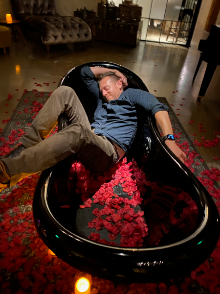

# mreff555 was here

*loath confluence, scrutinize man files, trust headers*

I'm sort of a bootstrapped developer, but I've reached that stage in my career where I just tell other people what do and get yelled at when they do it badly.  In my spare time I have a lot of hobbies that have nothing to do with computers, and most of them involving dirt , snow or booze.  I like Jeeps!  I like hiking into the middle of nowhere and spending a stupid amount of money on gear to pretend to be homeless for extended periods of time. I ski, drink beer, make beer, and sometimes when I've exhausted all other options, I code for fun.  I firmly believe that anything other than c/c++ is for lazy people with ADHD. and and Java is just an annoying insecure trend that hasn't died yet.  Below are a few coding, or engineering projects which are at varying levels of not done.  Some of them aren't much more complicated then nailing two boards together, while others took some thought.

## Projects:

[Keggorator Project](./projects/KeggeratorBuild.md) (*Finished/Ongoing*): The end goal was to never have to bottle beer again.  Or at least make it as painless as possible.  I wanted something that could hold multiple corney kegs for serving and maybe one for conditioning as well.  I also wanted it to be an all in one bar.

[Monitor Mount(*Finished*)](./projects/monitorMount.md): I acquired a couple of additional monitors and had no interest in paying for stupid overpriced mounts on the internet.

Office desk:

Mash tun temperature controller:

Home lighting system controller

Water flow monitor
