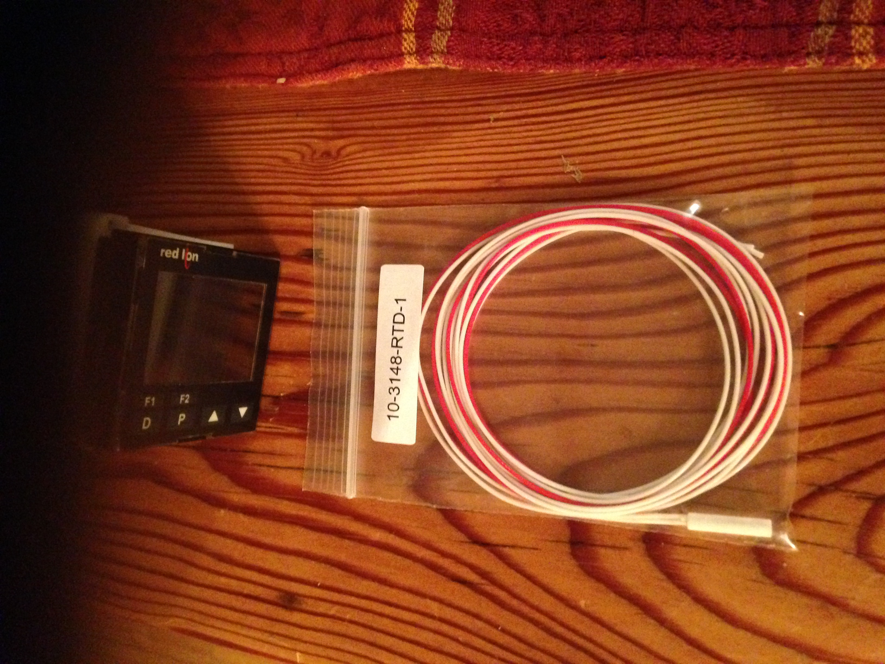
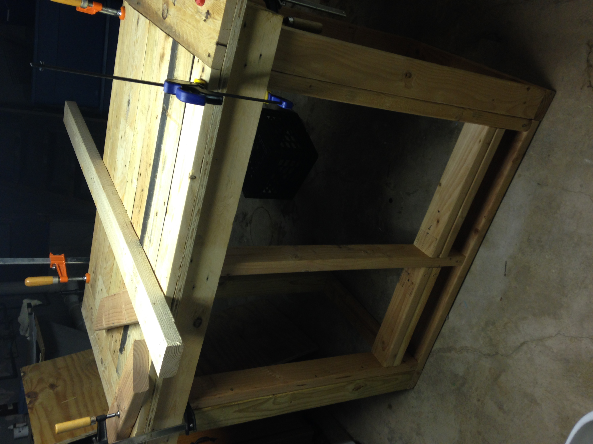
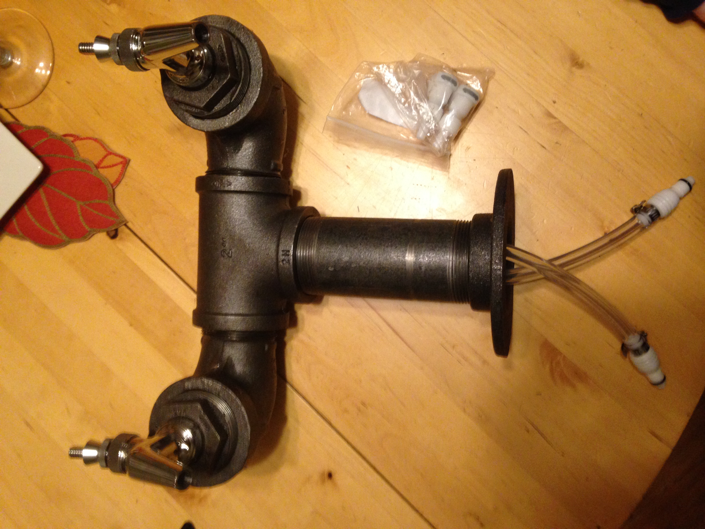
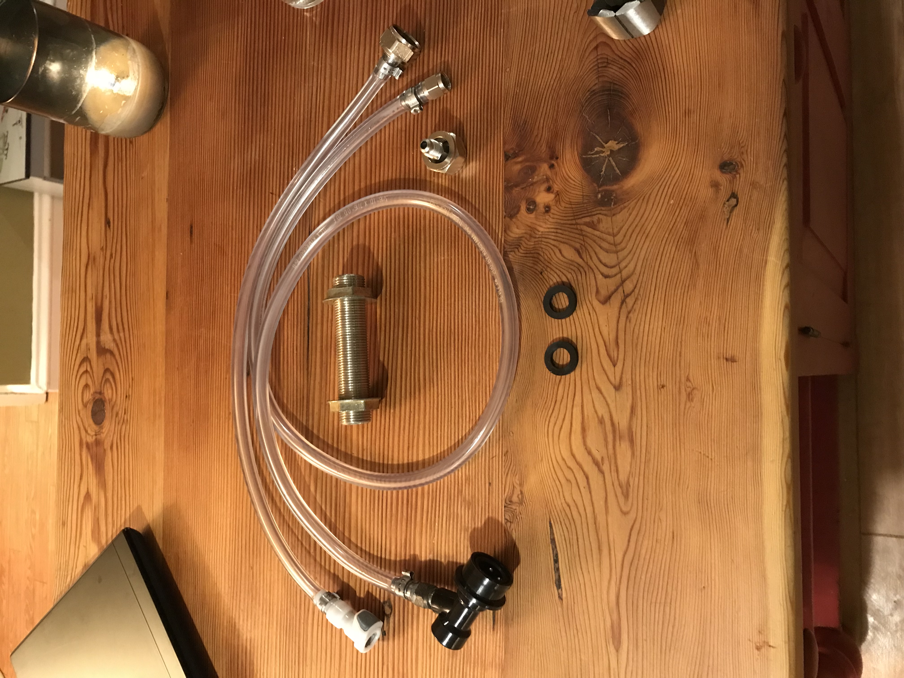
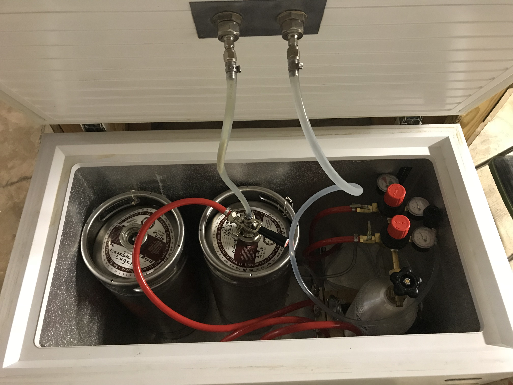

# Custom Keggerator build

I've been a home brewer since 2008.  It's a good hobby for a beer enthusiast at well as an engineer as it provides a creative outlet for both.  It does not by any means save you money.  At least not in my experience.  Primarily since every dollar I save, I tend to put back into R&D.  Primarily process development.  This is not the first or last component I created for brewing, and I will have to post more in the future.

### The Inspiration

Since I started brewing I have gone through hot and cold spells.  Primarily due to life.  For me, an all-grain batch, including set-up, take-down, starter cultivation, and finishing takes about 12-15 hours of active work.  Sometimes more before I started kegging.  This doesn't include any receipe research and planning.  The process generally started with starter prep in a Wednesday, the actual brewing process would either be a marathon Saturday project or as I later, started doing, splitting the process into two days.  A week later I'm transfering to secondary, and about a month after that I would go throught the tedious, and messy process of bottling.   In 2016, I had stopped for about a year.  When I decided I wanted to get back into brewing, I began with some self reflection, and decided that if I was going to start again, I needed to accomplish a couple of thing first, both which could be done with kegging:

- Increase quality control.  Unlike professional bottling lines, the home brewing method of bottle carbonation is error-prone and can cause batch to batch and even bottle to bottle inconsistencies.
- Knock a few hours off production time.
- Get rid of the boxes of bottles all over my house.

## The Design

I didn't have a lot of money, what I did have was lots of time and some access to spare parts.  I still had to buy a lot.  Here were the constraints I came up with when coming up with a design.

- It's gotta look cool. I wanted a straignt up bar, with industrial looking taps.
- At least two taps
- Needs to acomodate corney kegs as well as commercial 1/6 kegs.  Originally I wanted to acomodate 1/2 kegs but the required 15" diameter complecated other goals.
- Needs to hold 3 kegs, and have a duel regulator setup so I can serve two beers at one pressure, and carbonate another simotaneously.
- The refrigeration unit needs to fit under the bar.  I only have so much space.
- Need a temperature range between 32F and 70F +/- 1F, allowing for
  - Flexibility on serving temperature (32F - 40F)
  - Ideal protein rest temperatures around 40 F
  -  Summer fermentation temperatures (65F - 70F)

I eventually spec'ed out a 7.5CF chest freezer that seemed to be about the right size.  It wasn't perfect.  Headspace was tight, and the refrigerant was isobutane.  Cold enough for a kegerator, but needs to be grounded for safety reasons, which required me to modify my original design.  

In order to be able to dial in the temperature, some of the electronics had to be replaced.  I replaced the crude thermostat with a temperature controller.  I also replaced the thermocouple with the range I needed.  Note in the picture below there is an RTD pictured.  RTD's are more accurate but it didn't fit.  I ended up going with a thermocouple <not pictured>. They are cheaper.  They are no as accurate but because a chiller needs to have wide hysteresis to avoid burning out the motor this didn't really matter in the long run.

For the bar itself I had a bunch of pallets.  So I just tore them apart and recyled the the wood.  The construction was pretty simple.  I made it 42" bar height, on locking casters with a footrest bar and an opening large enough to allow it to slide over the kegerator.  The top was finished with a two part epoxy, the rest was just stained.

I wired up an electrical outlet under the bar, attached to an extention cord.  It was fused and had switched and always hot circuits, I put lights on the switched circuit.

For the tap design I wanted an industrial look so I used black pipe.  I played with the design a couple times before I got it right.  Since I needed to use the freezer door as a bulkhead, I went with food grade CPE connectors which could be disconnected without loss of fluid.  I used 316 stainless on all connections and platinum grade silicon for tubing.

|  |  |
| ---------------------------------------------- | ------------------------------------------------------- |

Insde the keggerator I build a crude mount for the 20lb CO2 bottle which sat over the compressor.  It attached to a duel pressure manifold. I reserved one for kegging while the other went to a distrobution manifold which could be attached to multiple kegs.

/* FINISH ME! */
