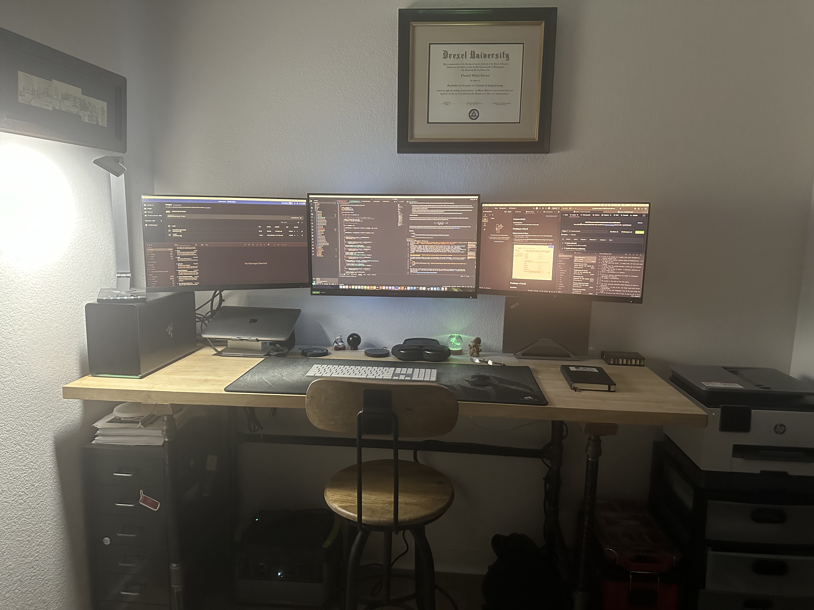
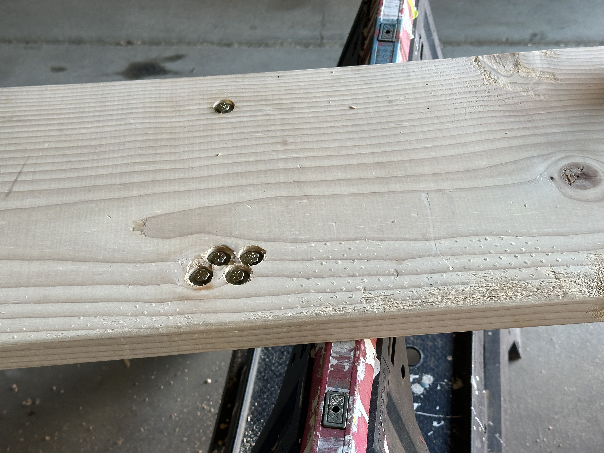
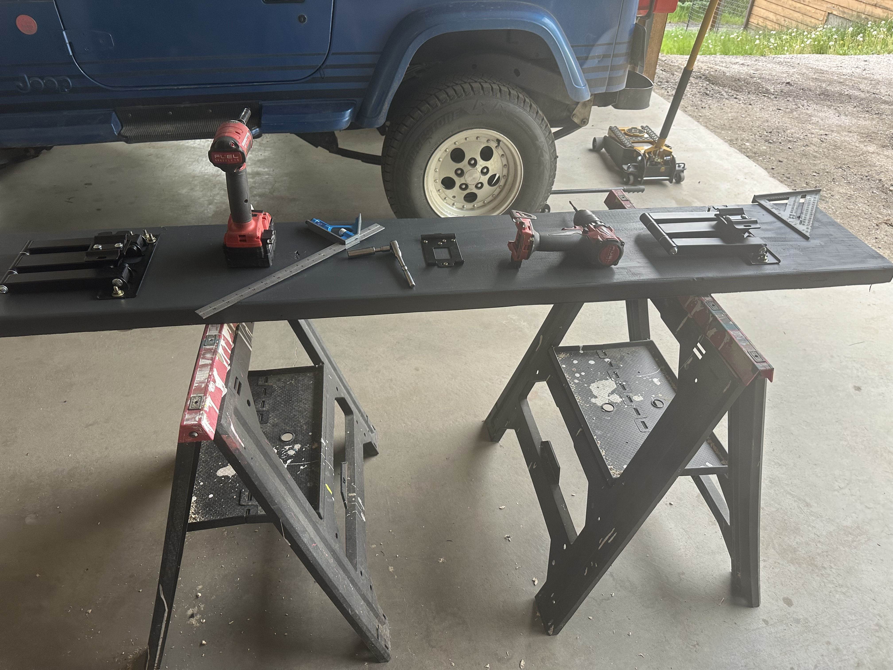
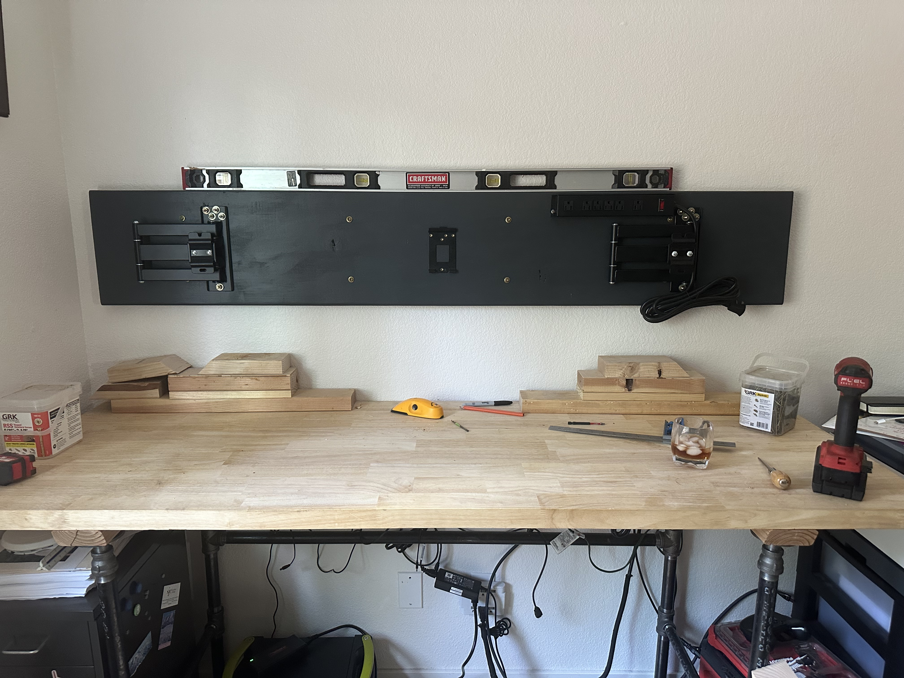
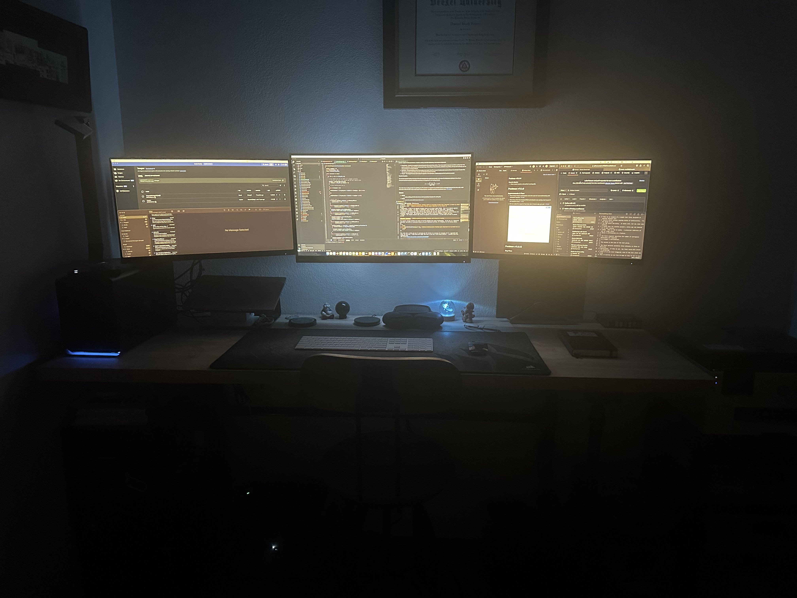

# 3 X Monitor Mount

When my office gave me a couple of monitors to allow me to better work from home, I realized that while I really did need at least two monitors for work, I only had one desk and my existing monitor for my personal computer was far better.  I decided to look at 3x monitor mounts and the findings were disappointing.  There weren't many options.  Most of them appeared to be flimsy and attach to the desk directly.  I didn't want my monitors wabbling around and to be honest, thats quite a bit of weight with lever arms to be supported by a tiny clamp on a desk.  The only wall mounts I found shipped from europe and were very expensive even before shipping.  I was suprised that what seemed simple enought to build would be so hard to find.  I thought there was a bigger market.

A few days later I see some cheap but durible monitor mounts at the Best Buy.  I attempted to relocate them online but was unable to find an exact match.  Similar though.  What I ended up buying is two full motion mounts which had a monitor range that could accomodate the 24" monitors I got from the office, and a simple 2 axis mount for the center 27"

| **Item**             | **Cost** |
| -------------------- | -------- |
| 2 axis mount         | $20      |
| 2 x 3 position mount | $70      |

When I got home and measured the mount dimensions the three position mounts needed 8" of vertical mounting space.  This quickly helped me resolve one decision.  I was debating between a wood or 80/20 substrate.  [80/20](https://8020.net/shop?utm_source=google&utm_medium=cpc&utm_campaign=pmax&utm_content=products&gad_source=1&gclid=Cj0KCQjwpZWzBhC0ARIsACvjWROcPNUYnwNLdjuFpZNFB7znZzNAjihR8Mu2mYtSpuvn_iHAwS7QejIaAhGxEALw_wcB) extruded aluminum looks cool and is strong as hell.  It also resists tear-out which is important with a cantaleivered mount and finally it would have been adjustible for future, better monitors.  The problem is that it is really expensive and even the larger 120mm beams would have been half the size I needed.  I probably could have done it with either a custom fabricated bracket with some [half inch aluminum from McMaster](https://www.mcmaster.com/products/aluminum/shape~sheet/shape~sheet-and-bar/width~4/thickness~1-2-1/thickness~0-500/), or they even sell some generic brackets that might have worked, but this would have expentially increased the cost of the project.  Upon realizing that you wouldn't even see the substrate it became difficult to justify.  Never the less it would be a solid option if it worked for you.

I ended up setting for a 2x10". I actually ended up with a 2x12" because thats all they had at Home Depot.  I also picked up a small power mountable supply to help hide the cables.  The 3 position mounts accepted 5 x 1/4" screws so I bought 10 x grade 8, 2" bolts with nuts and 2 washers each.  Keep in mind the brackets you will find may take different hardware.  Also note that using bolts  as opposed to screws is significantly more work but has good compression strength and resists tear-out. I am going to list a some hardware which I already had but you may want to pick it up if you do not.  I'll estimate the cost but honestly I'm not sure.

| **Item**                                                     | **Cost** |
| ------------------------------------------------------------ | -------- |
| 2" x 12" x 8'                                                | $16      |
| Small mountable power supply                                 | $17      |
| 10 x (gr8 2" x 1/4-20), 20 x (gr8 1/4" washers), 10 x  (gr8 1/4" nuts).  Locknuts would also be good | $22      |
| Forsner bit with the same diameter as the washers            | ~$13     |
| 1 1/2" good quality wood screws for the center mount (This will depend on the mount you get) | ~$20/box |
| Paint (a small sample container should be enough for a couple coats) | ~$6      |
| Some type of removeable wire suspension.  I used [these](https://www.mcmaster.com/3225T44/) b/c I already had them. | $10      |
| 3 1/2" lag screws.  I went with 5/16 diameter because I had them. definately overkill but it works | $25/box  |

Some other tools you will want to have are:

| measuring tape                                    | drill and various bits |
| ------------------------------------------------- | ---------------------- |
| screw drivers                                     | wood punch             |
| pencils level                                     | combination square     |
| small impact gun or rachet set for the lag screws | stud finder            |

### The Layout

My desk is 72 inches wide.  Advertised monitor dimensions are on the diagonal, so the actual width of the monitors were actually 24-1/8" for the larger and 21-1/4" for the smaller two.  Allowing for 1/2" of space between monitors when they are sitting flat had an overall finished width of 67 5/8".  Subtracting 2x half the smaller monitor width, or essentially one monitor with we find the center to center difference between the outer bracket which was 46-3/8". Adding a couple inches to each side we determine the very shortest that the board could be.  I probably could have gone as small as 52" but I settled on 70" because I have a small office, where you won't see the monitors from the side and with the monitor angles you won't see board.  Also, I wanted to be able to hit 4 studs and still have full control over where I mounted the board.  I would have preferred to cut the ends to 45 degree angles but it was difficult to get a good cut with my 12" radial arm saw so I cut them flush and sanded the ends.

I started by looking sitting in my chair and staring straight ahead this became the center point for the center monitor and I market this on the wall.   Since this happened to be the center of the desk it made the horizontal math easy.  The board would be installed 1 1/2" from each end of the desk.  I used a stud finder to find the studs marking each side and finding the center.  I put the marking above where the board would be installed.

Taking the board out to the garage I found the center and used a combination square to make sure I had the center bracket aligned.  using a wood punch I marked the screw holes.  To find the correct distance to the side mounts, giving the sizes I specified I added the Middle and left monitor widths plus 1 for the gap and divided by 2.  I added 1 because of the bracket offset from the mount.
$$
\frac{1}{2}(21.25 + 24.125 + 1) + 1 = 24.1.1875
$$
Note that I used the same math for the right side but subtracted by 1 rather than adding since the bracket was mounted in the same orientation.  Using these dimensions I aligned the side brackets and marked the holes.

### Initial prep

I started drilling out the holes. even the screw holds in the center to preserve exact positions and prevent splintering.  I drilled the sides out to 1/4".  Then I flipepd it over and used the mentioned forsner bit to make recesions deep enough to make the bolt heads and washers for the outside monitors flush.  After confirming that the bolts fit the bracket I prepped from painting with a quick 220 grit sand.  I also taped the edges of the bottom because I specifically did not want to paint the bottom.  In case I remove the mount it would just make for un-needed mess.  I gave it two coats and let it dry overnight.

### Mounting prep

Once the paint was dry, I installed the bracket's and confirmed they were square.  At this point I would switch gears and begin getting ready to mount the board.  Attaching a power strip or wire looms, you need to know where the bolts need to mount.

Measure the distance from the center point on your wall you marked the other day to the desk.  Subtract half the **measured** width of your board.  Remember it is less than nominal width.  The board is going ot be heavy so you need blocks or something else to build up to hold it level and in place.  If you end up being a 1/8" high or low, this is probably not a big concern, but the closer the better.  Once the board is centered in position use the stud markings you drew before and transfer the markings to the top of the board.  then using a combination square transfer them to the front of the board.  I put mine it a unifrom 2 1/2" from each edge.  8 in total.  This decision was what worked for me because I had already mounted my power strip.  You can go closer to the edge, but I wouldn't go closer than 1 1/2".  Punch out the markings and drill them half way through the board with a slightly smaller bit.  At this point if you want to install the power strip, do it.  If you know exactly how you want to run your wiring you can install any wire management you have.  I waited until I had the two center monitors mounted to do this.  Start the lag screws in the holes you made.  Make certain they are straight. 

### Installation

Put the board back and position and use an impact gun to install the screw.  If you do not have one you can use a drill but once the bit enters the stud, use a rachet.  Even if your drill is strong enough to fully install the screw, it is hard on the drill.  Once the first screw is in confirm the board is straight.  You should be using a 4' level at least.  Shim as necessary.  Get it perfect.  The longer the board, the more being a 1/16" off will be noticeable.  Once it is straight install the other screws.

Follow the manufacturer instructions to install the mount backing plates.  **Usually** this is the easy part. In my case, my existing monitor did not use a typical mounting design, so I had to drill additional holes in the plate, cut #8 screws to the correct length to avoid putting pressure on the monitor and stack up spacers to make it work.  *If you have to do this, an electricians multi-tool and a strong grip can cut #8's anything bigger and you will want to thread a nut on and use a cutoff tool to cut under the nut.  Finally remove the nut to align the threads.*

### Clean-up

I recommend installing the side monitors first.  This will allow you to clean up your wiring easer.  Remember if possible route your data cables away from power cables.  I ran my power cables near the top to the power supply on the right and the HDMI cables at the bottom to the left, into my eGPU.  Use zip ties where needed, align your monitors and test it out.  

Comments or questions: [e-mail me](mailto:feerstd@gmail.com)